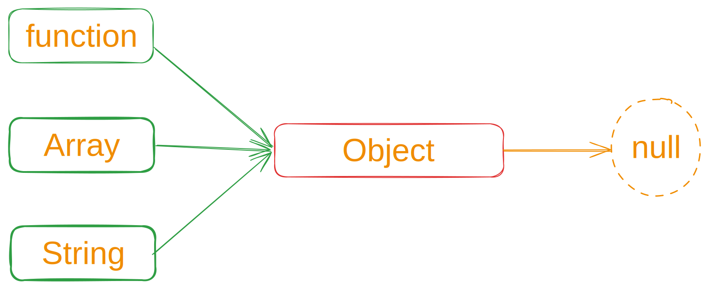
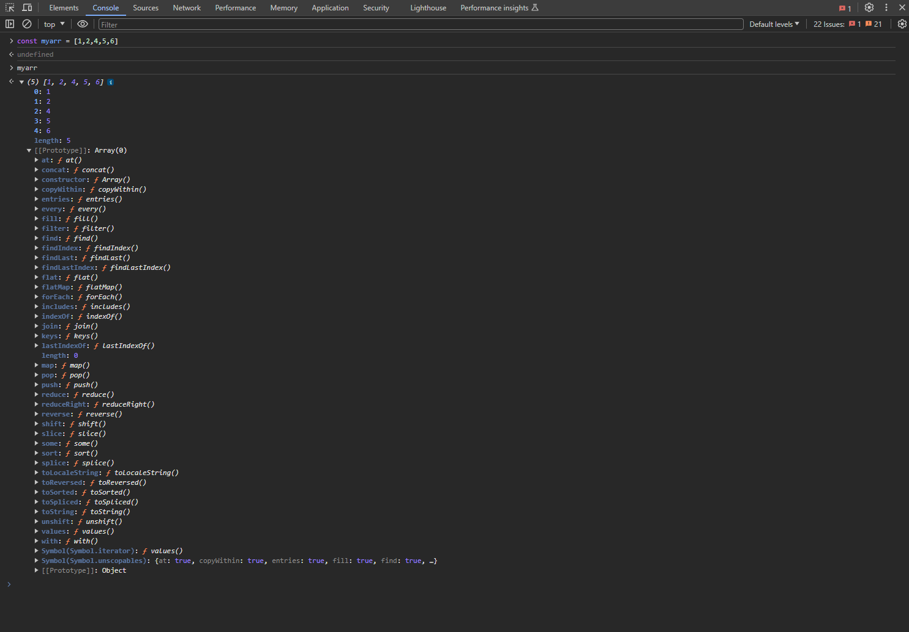
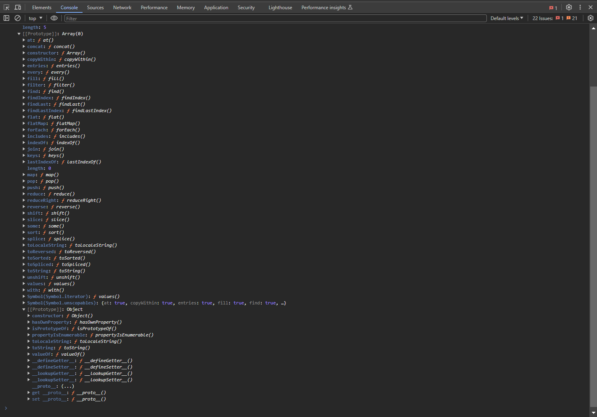

> [!IMPORTANT]
>The default behavior in JavaScript is prototypal inheritance. 

When a property or method is not found in an object, JavaScript looks one step back in the prototype chain, checking its parent. If the property or method is still not found, it continues further up the chain, reaching the grandparent, and so on. If the property or method is not found throughout the entire prototype chain, the result is `null`. This mechanism is known as prototypical inheritance.

In JavaScript, functions, arrays, and strings are objects. Properties and methods existing in an object can be accessed by functions, arrays, and strings since they inherit them. However, properties or methods specific to functions, arrays, or strings cannot be accessed by regular objects.

